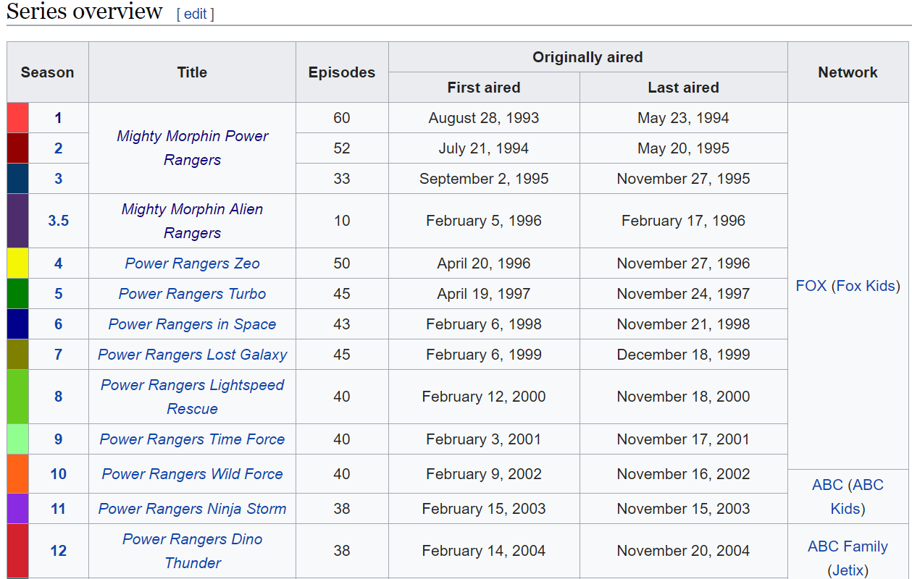
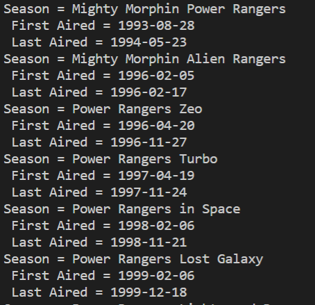
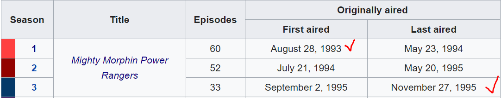

# Web Scraping List of Power Ranger Seasons from *wikipedia.org* using BeautifulSoup
### Web Scraping
Web scraping is a method to copy the data in a certain website without having to copy paste it manually, especially for website that has no available API.

Scraping list of power ranger seasons from https://en.wikipedia.org/wiki/List_of_Power_Rangers_episodes, to get the name of the season and both its first aired and last aired dates using *BeautifulSoup*. Check out the screenshot of the wikipedia web page:


1. Install *Beautiful Soup* package using:
    ```bash
    $ pip install beautifulsoup4
    ```
    Or using another writing method:
    ```bash
    $ py -m pip install beautifulsoup4
    ```

2. Clone this repo and *run* the program.

3. The sreenshot of how the output data will look like in your terminal:
    

**To be developed next:**
In the wikipedia page table, the first power ranger title lasts for 3 seasons. Therefore, the output last aired date for that title should be the last one (in the third row). However, I have not yet developed the corresponding algorithm yet. This is how the first power ranger title looked like in the wikipedia table:
    


### **_Enjoy!_**

#

#### Albertus Rianto Wibisono ✉ _albertusrian95@gmail.com_

[Instagram](https://www.instagram.com/rian__wibisono) | 
[LinkedIn](https://www.linkedin.com/in/albertusrian95/) |
[GitHub](https://www.github.com/RiantoWibisono)
